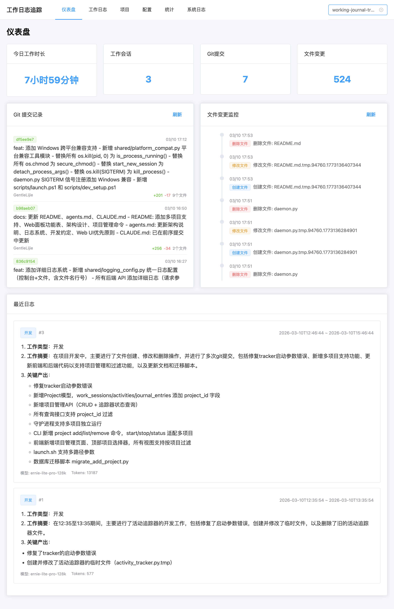
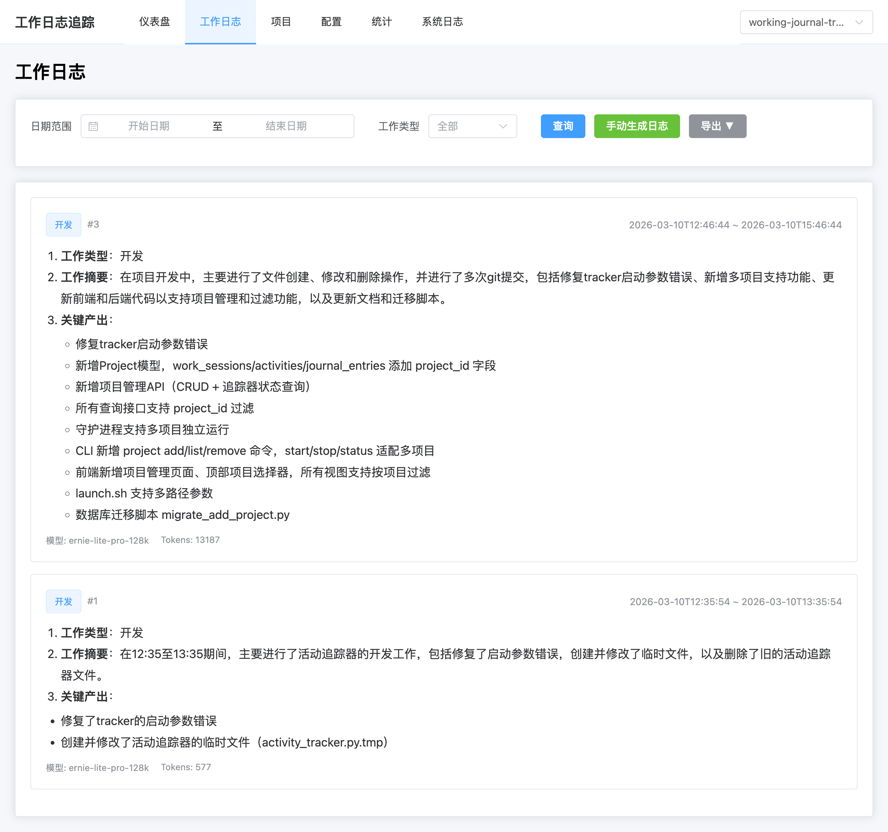
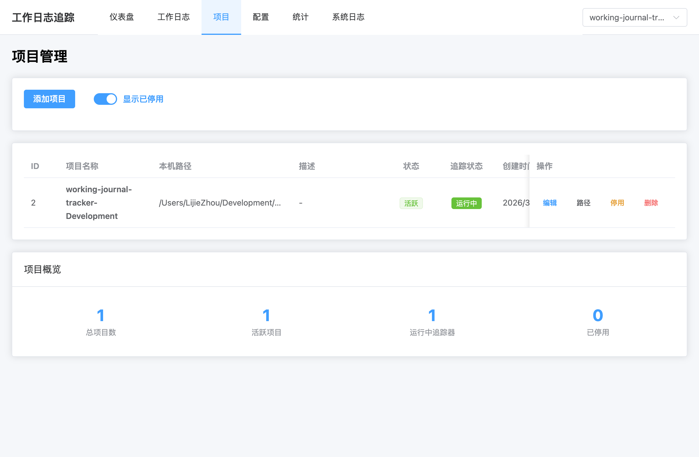
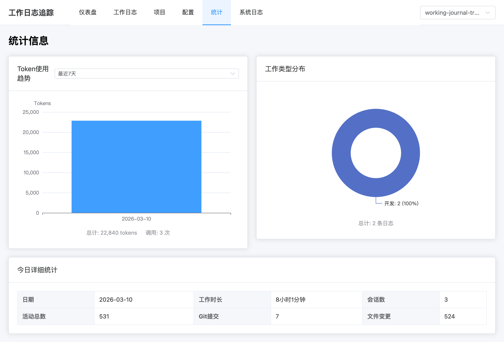
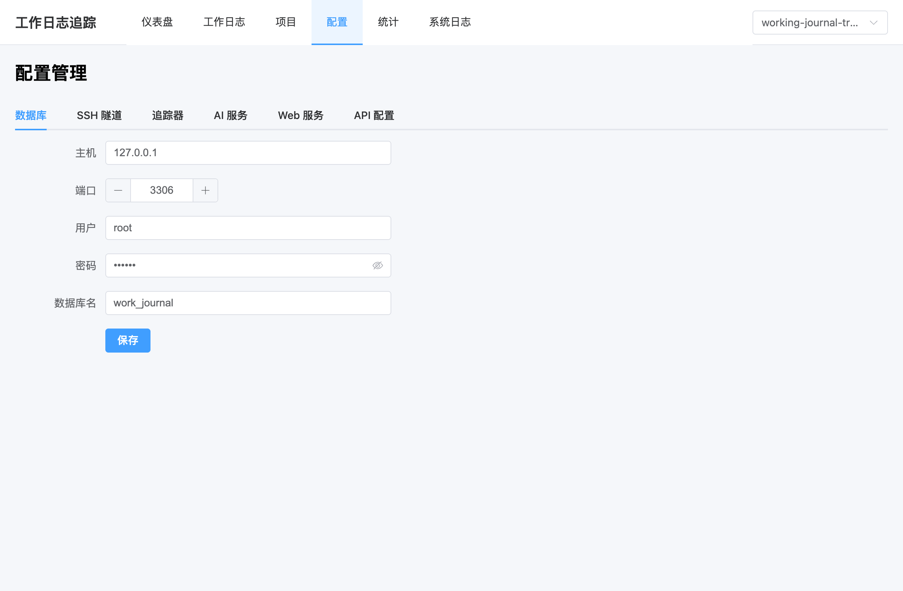
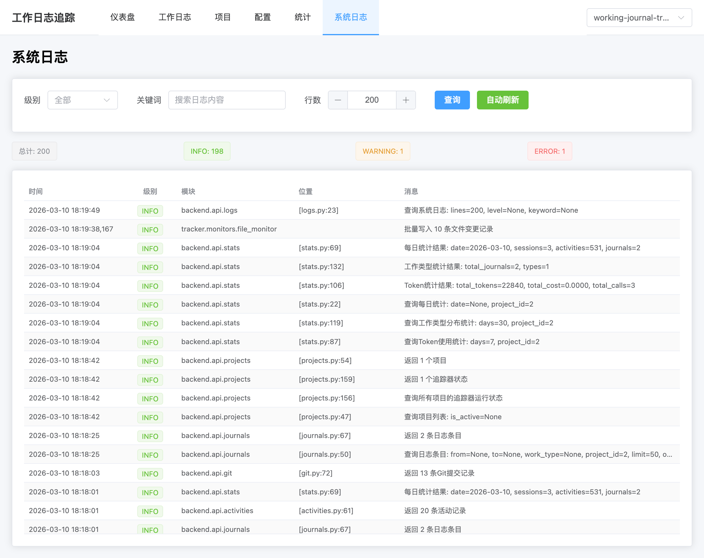

# 工作日志追踪工具

[](https://www.python.org)
[](https://fastapi.tiangolo.com)
[](https://vuejs.org)
[](https://www.mysql.com)
[](LICENSE)
[]()

一个基于 Python 的工作日志自动追踪系统，通过监控 Git 提交和文件变更，自动记录工作活动并生成智能摘要。支持多项目同时追踪、多设备协作。

## 功能特性

- 🔍 **自动追踪** — 实时监控 Git 提交和文件变更
- 📝 **智能摘要** — AI 自动生成工作摘要并分类，每个整点自动生成
- 📁 **多项目支持** — 同时追踪多个项目，独立守护进程
- 🖥️ **多设备协作** — 路径信息本地化存储，多台设备共享同一数据库
- 💻 **CLI 工具** — 简洁的命令行界面，快速启动/停止追踪
- 🌐 **Web 面板** — 可视化仪表盘、项目管理、日志查看、配置管理
- 📂 **目录选择器** — Web 端可视化浏览和选择本机项目路径
- 🔒 **安全连接** — 支持 SSH 隧道连接云端数据库
- 📊 **数据统计** — 工作时长、Token 使用、工作类型分布
- 📋 **系统日志** — 完整的后端日志系统，Web 端实时查看
- 📤 **数据导出** — 支持导出 Excel 和 Markdown 格式

## 界面预览

### 仪表盘



### 工作日志



### 项目管理



### 统计分析



### 系统配置



### 系统日志



## 快速开始

### 安装

```bash
# 克隆仓库
git clone git@github.com:Gentle-Lijie/working-journal-tracker.git
cd working-journal-tracker

# 安装依赖
pip install -e .

# 前端依赖
cd frontend && pnpm install && cd ..

# 初始化配置
work-journal config init

# 编辑配置文件
vim ~/.work-journal/config.yaml

# 初始化数据库
python scripts/init_db.py

# 数据库迁移（多项目支持）
python scripts/migrate_add_project.py

# 路径本地化迁移（多设备支持）
python scripts/migrate_remove_path.py
```

### 基本使用

```bash
# 开始追踪（自动创建项目记录）
work-journal start --path /path/to/project

# 同时追踪多个项目
work-journal start --path /path/to/project1
work-journal start --path /path/to/project2

# 查看所有项目状态
work-journal status

# 生成摘要
work-journal summary --last-hour

# 停止指定项目
work-journal stop --project <name>

# 停止所有追踪
work-journal stop

# 启动 Web 面板
work-journal config web
```

### 项目管理

```bash
# 添加项目
work-journal project add <name> <path>

# 列出所有项目
work-journal project list

# 移除项目
work-journal project remove <name>
```

### 一键启动

```bash
# 启动后端 + 前端 + 追踪器（支持多项目）
bash scripts/launch.sh /path/to/project1 /path/to/project2
```

## Web 面板

Web 面板提供完整的可视化管理界面，功能覆盖并超越 CLI：

| 页面 | 功能 |
|------|------|
| 仪表盘 | 今日概览、Git 提交记录、文件变更监控、最近日志 |
| 工作日志 | 日志查询、手动生成、导出 Excel/Markdown |
| 项目管理 | 项目 CRUD、本机路径配置（目录选择器）、追踪器状态 |
| 配置 | 数据库、SSH 隧道、追踪器、AI 服务配置 |
| 统计 | Token 使用趋势、工作类型分布、每日详细统计 |
| 系统日志 | 实时日志查看、级别过滤、关键词搜索、自动刷新 |

所有数据视图支持按项目过滤（顶部项目选择器）。

## 配置说明

配置文件位于 `~/.work-journal/config.yaml`

```yaml
database:
  host: localhost
  port: 3307
  user: work_journal
  password: ${DB_PASSWORD}  # 从环境变量读取
  database: work_journal

ssh:
  enabled: true
  config_name: default

tracker:
  git_check_interval: 30  # Git 检查间隔（秒）
  file_batch_size: 10
  file_batch_interval: 300
  ignored_patterns:
    - "*.pyc"
    - "__pycache__"
    - "node_modules"
    - ".git"

ai:
  default_config: default
  retry_attempts: 3
  timeout: 30

web:
  host: 127.0.0.1
  port: 8000
```

## 多设备支持

项目路径信息存储在本地 `~/.work-journal/path_map.yaml`，而非数据库中。这意味着：

- 同一个项目在不同设备上可以有不同的本地路径
- 多台设备可以共享同一个数据库，互不干扰
- 每台设备首次使用时需配置本机路径（CLI 或 Web 目录选择器）

## 自动日志生成

追踪器守护进程会在每个整点自动生成工作日志：

- 时间范围：上一条日志的结束时间 → 当前时间
- 首次生成时从会话开始时间算起
- 无活动记录时自动跳过
- 使用 AI 生成智能摘要（AI 不可用时回退到基本摘要）

## 技术栈

- **后端**：Python 3.12, FastAPI, SQLAlchemy, GitPython, watchdog
- **前端**：Vue 3, Vite, Pinia, Element Plus, ECharts
- **数据库**：MySQL 8.0+
- **AI 集成**：OpenAI 兼容 API

## 项目结构

```
working-journal-tracker/
├── cli/                    # CLI 命令行工具
│   ├── main.py            # CLI 入口（Click 框架）
│   └── commands/          # 命令实现
│       ├── start.py       # 启动追踪
│       ├── stop.py        # 停止追踪
│       ├── status.py      # 查看状态
│       ├── summary.py     # 生成摘要
│       ├── config.py      # 配置管理
│       └── project.py     # 项目管理
├── backend/               # FastAPI 后端
│   ├── main.py           # 应用入口
│   ├── database.py       # 数据库连接
│   ├── models/           # 数据库模型
│   │   ├── project.py    # 项目模型
│   │   ├── work_session.py
│   │   ├── activity.py
│   │   └── journal_entry.py
│   ├── api/              # API 路由
│   │   ├── projects.py   # 项目 CRUD + 路径管理
│   │   ├── activities.py # 活动记录
│   │   ├── journals.py   # 日志查询与生成
│   │   ├── stats.py      # 统计信息
│   │   ├── git.py        # Git 日志
│   │   ├── filesystem.py # 目录浏览（供前端选择器）
│   │   ├── logs.py       # 系统日志
│   │   ├── ai.py         # AI 接口
│   │   └── config.py     # 配置管理
│   └── services/         # 业务逻辑
├── tracker/              # 后台追踪服务
│   ├── daemon.py        # 守护进程（多项目 + 自动日志）
│   └── monitors/        # 监控器
├── shared/              # 共享代码
│   ├── config.py       # 配置管理
│   ├── constants.py    # 常量定义
│   ├── path_map.py     # 本地路径映射
│   ├── utils.py        # 工具函数 + 多 PID 管理
│   └── logging_config.py # 统一日志配置
├── frontend/           # Vue 3 前端
│   └── src/
│       ├── App.vue         # 主布局（含项目选择器）
│       ├── stores/         # Pinia 状态管理
│       ├── views/          # 页面组件（6 个）
│       ├── components/     # 可复用组件（目录选择器等）
│       └── api/client.js   # API 客户端
└── scripts/            # 工具脚本
    ├── launch.sh       # 一键启动（多项目）
    ├── migrate_add_project.py   # 多项目迁移
    ├── migrate_remove_path.py   # 路径本地化迁移
    └── init_db.py      # 数据库初始化
```

## 架构设计

### 多项目支持

- 单数据库 + `project_id` 字段区分项目数据
- 每个项目独立守护进程，PID 文件 `~/.work-journal/tracker-{project_id}.pid`
- 所有查询接口支持 `project_id` 过滤
- 旧数据向后兼容（`project_id=NULL` 在全部项目视图中可见）

### 路径本地化

- 项目通过 `name`（UNIQUE）关联，路径存储在本地 `path_map.yaml`
- 支持多设备各自维护不同路径，共享同一数据库

### 数据模型

```
Project (1) ──> (N) WorkSession
Project (1) ──> (N) Activity
Project (1) ──> (N) JournalEntry
WorkSession (1) ──> (N) Activity
```

## 开发

```bash
# 安装开发依赖
pip install -e ".[dev]"

# 运行后端
uvicorn backend.main:app --reload

# 运行前端
cd frontend && pnpm dev
```

## 许可证

MIT License

## 作者

Gentle-Lijie
